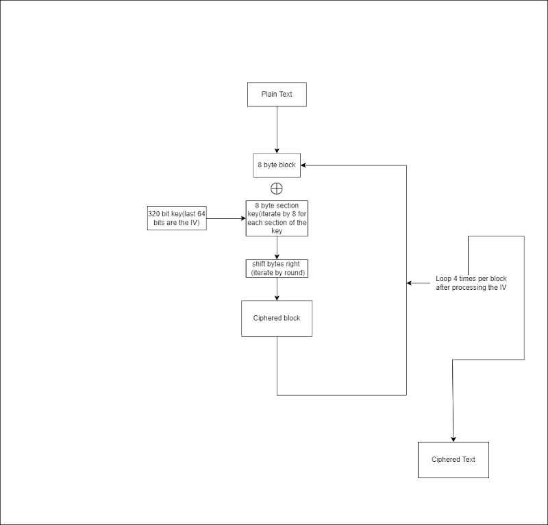

# Krypton

### How it works?

Krypton uses a 320-bit key. last 64 bits is the IV.
since krypton doesnt use IV generation, it includes in at the end of the key

### FlowChart

### Implementation
if you would like to implement this in any programming language go for it. if you successfully implement it, email me at notaidan99@gmail.com and I can upload it
