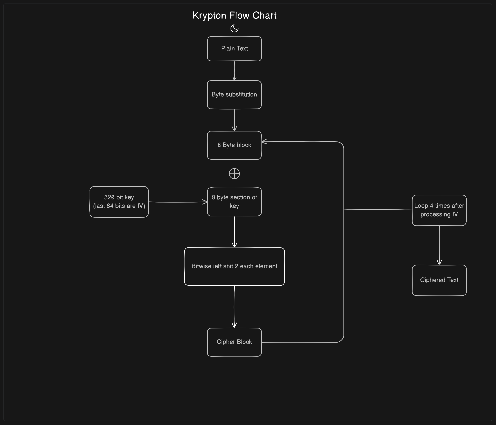
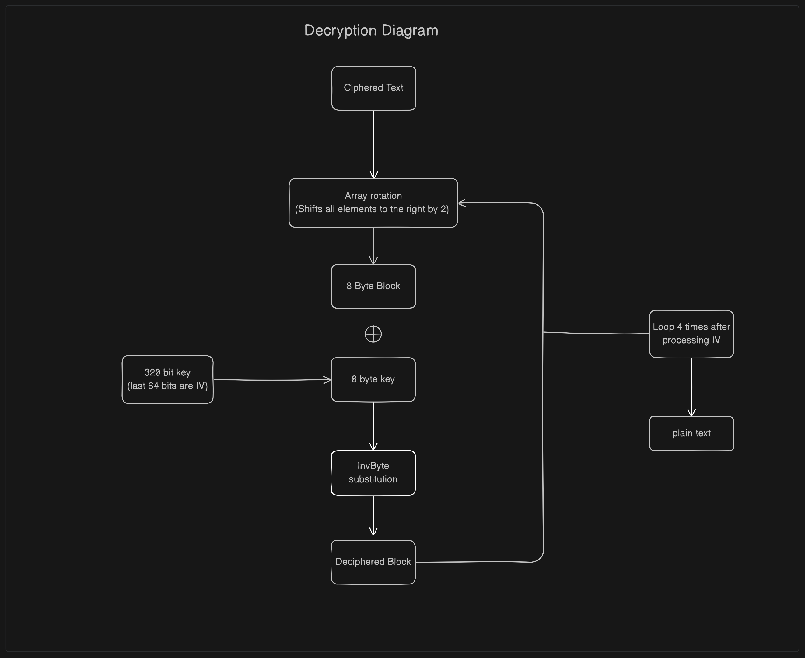

# Krypton

### How it works?

Krypton uses a 320-bit key. last 64 bits is the IV.
since krypton doesnt use IV generation, it includes in at the end of the key. 
The whole algorithm was made by me around mid of 2022

update as of 7/30/2023:

byte substitution will be added to maintain security. I will either use a custom s-box or a AES Rijndael S-box

### Encryption diagram

### Decryption diagram

### Implementation
if you would like to implement this in any programming language go for it. if you successfully implement it, email me at notaidan99@gmail.com and I can upload it

flowchart made with eraser.io
